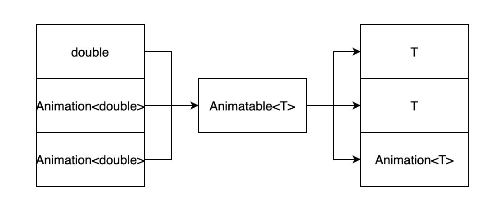
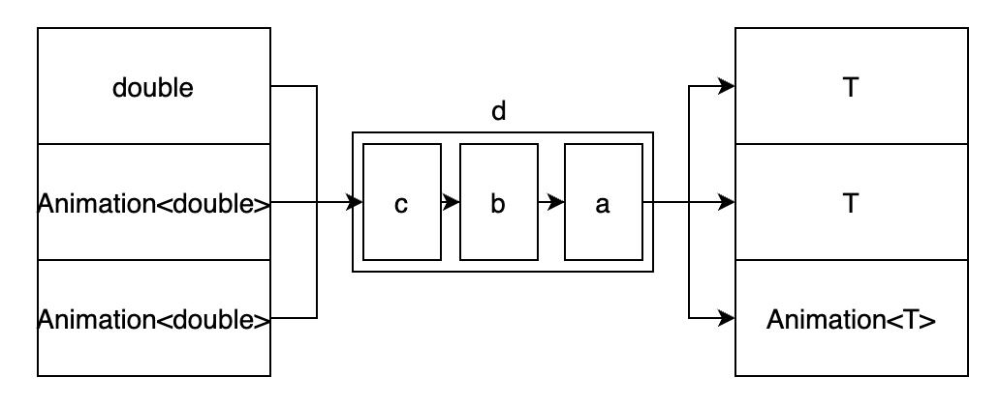

## Animatable

```dart
// Copyright 2014 The Flutter Authors. All rights reserved.
// Use of this source code is governed by a BSD-style license that can be
// found in the LICENSE file.

abstract class Animatable<T> {
  T transform(double t);
  T evaluate(Animation<double> animation) => transform(animation.value);
  Animation<T> animate(Animation<double> parent)
  Animatable<T> chain(Animatable<double> parent)
}
```

https://github.com/flutter/flutter/blob/2.2.2/packages/flutter/lib/src/animation/tween.dart

`Animatable`具有类型属性T，提供三个函数功能：

1. `transform`将`double`转化为T。
2. `evaluate`将`Animation<double>`转为T。
3. `animate`将`Animation<double>`转为`Animation<T>`

这三个转化过程里，double -> T 映射关系的实现都是`transform`的逻辑。因此Animatable的子类只需要重写transform既可以自定义三种映射功能。



`Animtable`还提供`chain`方法，将多个`Animatable`的逻辑依次组合起来，不过传入的`Animatable`需要是`Animatable<double>`类型。举个例子

```dart
Animation<T> a;
Animatable<double> b, c;
Animation<T> d = a.chain(b).chain(c);
```



d的转化功能相当于对输入依次用c，b，a转化。


## Tween

`Tween`是`Animatable`最常用的子类，它对自变量域[begin, end]提供一个线性函数功能。

```dart

/// A linear interpolation between a beginning and ending value.
///
/// 案例，两种创建Animation的方法
AnimationController _controller;
Animation<Offset> _animation;
/// 1.
_animation = _controller.drive(
   Tween<Offset>(
     begin: const Offset(100.0, 50.0),
     end: const Offset(200.0, 300.0),
   ),
);

/// 2.
_animation = Tween<Offset>(
   begin: const Offset(100.0, 50.0),
   end: const Offset(200.0, 300.0),
).animate(_controller);
///
/// ## Performance optimizations
///
/// Tweens are mutable; specifically, their [begin] and [end] values can be
/// changed at runtime. An object created with [Animation.drive] using a [Tween]
/// will immediately honor changes to that underlying [Tween] (though the
/// listeners will only be triggered if the [Animation] is actively animating).
/// This can be used to change an animation on the fly without having to
/// recreate all the objects in the chain from the [AnimationController] to the
/// final [Tween].
///
/// If a [Tween]'s values are never changed, however, a further optimization can
/// be applied: the object can be stored in a `static final` variable, so that
/// the exact same instance is used whenever the [Tween] is needed. This is
/// preferable to creating an identical [Tween] afresh each time a [State.build]
/// method is called, for example.
///
class Tween<T extends dynamic> extends Animatable<T> {
  Tween({
    this.begin,
    this.end,
  });
  T? begin;
  T? end;
  @protected
  T lerp(double t) // T = f(t), begin <= t <= end
  @override
  T transform(double t)
}
```


### ReverseTween

传入一个`Tween`，对其`lerp`的值的倒置，相当于改变系数的符号，注意传入的`Tween`未必是线性函数

```dart

/// A [Tween] that evaluates its [parent] in reverse.
class ReverseTween<T> extends Tween<T> {
  /// Construct a [Tween] that evaluates its [parent] in reverse.
  ReverseTween(this.parent)
    : assert(parent != null),
      super(begin: parent.end, end: parent.begin);
  final Tween<T> parent;

  @override
  T lerp(double t) => parent.lerp(1.0 - t);
}
```


### ColorTween

```dart
/// An interpolation between two colors.
class ColorTween extends Tween<Color?> {
  /// We recommend that you do not pass [Colors.transparent] as [begin]
  /// or [end] if you want the effect of fading in or out of transparent.
  /// Instead prefer null. [Colors.transparent] refers to black transparent and
  /// thus will fade out of or into black which is likely unwanted.
  ColorTween({ Color? begin, Color? end }) : super(begin: begin, end: end);

  /// Returns the value this variable has at the given animation clock value.
  @override
  Color? lerp(double t) => Color.lerp(begin, end, t);
}
```


### SizeTween

```dart
/// An interpolation between two sizes.
///
class SizeTween extends Tween<Size?> {
  SizeTween({ Size? begin, Size? end }) : super(begin: begin, end: end);
  @override
  Size? lerp(double t) => Size.lerp(begin, end, t);
}
```


### RectTween

```dart
/// An interpolation between two rectangles.
///
class RectTween extends Tween<Rect?> {
  RectTween({ Rect? begin, Rect? end }) : super(begin: begin, end: end);
  @override
  Rect? lerp(double t) => Rect.lerp(begin, end, t);
}
```


### IntTween

`lerp`可能包含double乘法，因此返回值不能是int，为了支持int型的映射，`StepTween`对结果向下取整，`IntTween`四舍五入取整。

```dart
/// An interpolation between two integers that rounds.
///
class IntTween extends Tween<int> {
  IntTween({ int? begin, int? end }) : super(begin: begin, end: end);
  @override
  int lerp(double t) => (begin! + (end! - begin!) * t).round();
}
```

### StepTween

`lerp`可能包含double乘法，因此返回值不能是int，为了支持int型的映射，`StepTween`对结果向下取整，`IntTween`四舍五入取整。

```dart
/// An interpolation between two integers that floors.
///
class StepTween extends Tween<int> {
  StepTween({ int? begin, int? end }) : super(begin: begin, end: end);
  @override
  int lerp(double t) => (begin! + (end! - begin!) * t).floor();
}
```


### ConstantTween

`begin` = `end`，系数为0的函数

```dart
/// A tween with a constant value.
class ConstantTween<T> extends Tween<T> {
  ConstantTween(T value) : super(begin: value, end: value);
  @override
  T lerp(double t) => begin as T;
  @override
  String toString() => '${objectRuntimeType(this, 'ConstantTween')}(value: $begin)';
}
```


### CurveTween

使用内置的`Curve`来`transform`传入的double

```dart
/// Transforms the value of the given animation by the given curve.
///
/// This class differs from [CurvedAnimation] in that [CurvedAnimation] applies
/// a curve to an existing [Animation] object whereas [CurveTween] can be
/// chained with another [Tween] prior to receiving the underlying [Animation].
/// ([CurvedAnimation] also has the additional ability of having different
/// curves when the animation is going forward vs when it is going backward,
/// which can be useful in some scenarios.)
///
/// {@tool snippet}
///
/// 使用例子
final Animation<double> animation = _controller.drive(
   CurveTween(curve: Curves.ease),
);
/// {@end-tool}
///
class CurveTween extends Animatable<double> {
  CurveTween({ required this.curve })
    : assert(curve != null);
  Curve curve;
  @override
  double transform(double t)
  @override
  String toString() => '${objectRuntimeType(this, 'CurveTween')}(curve: $curve)';
}
```


